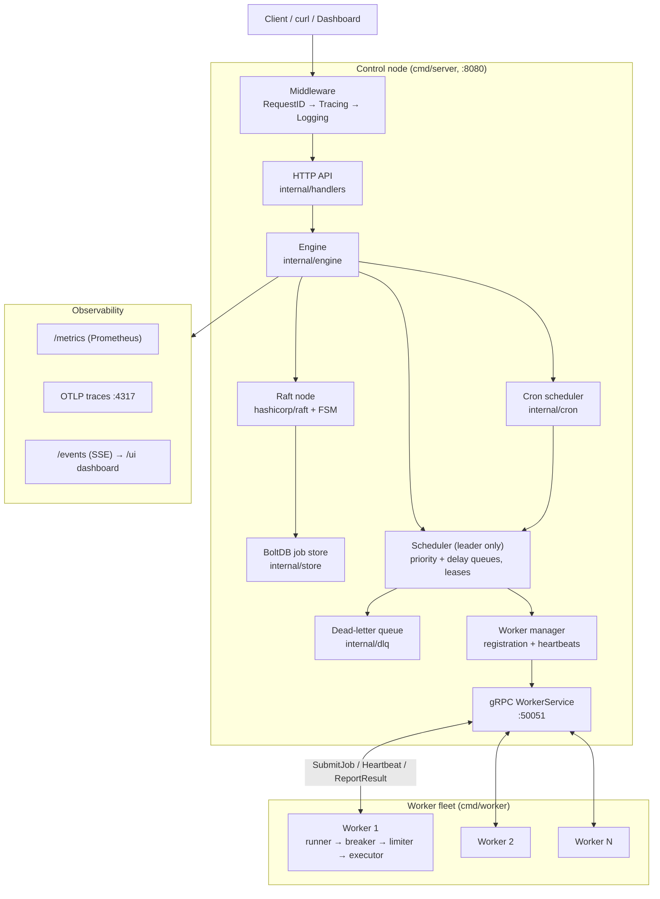
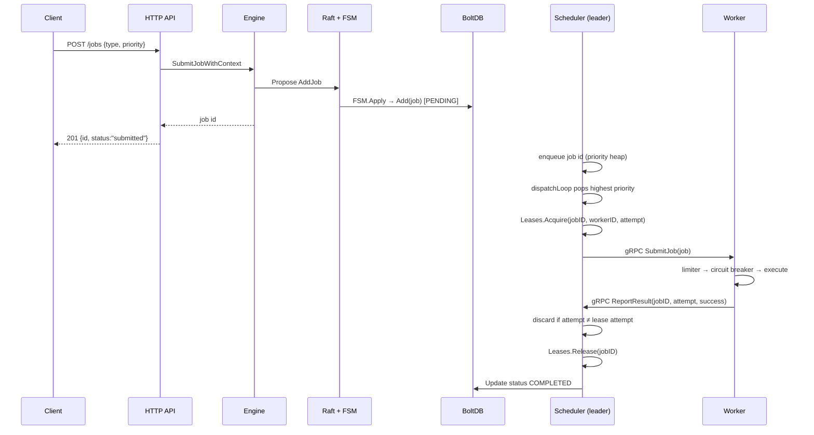
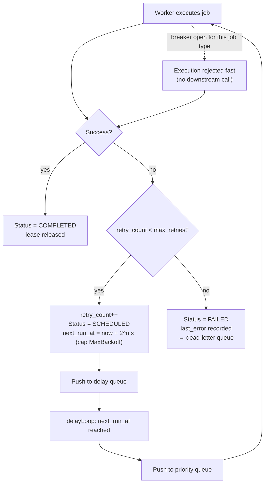
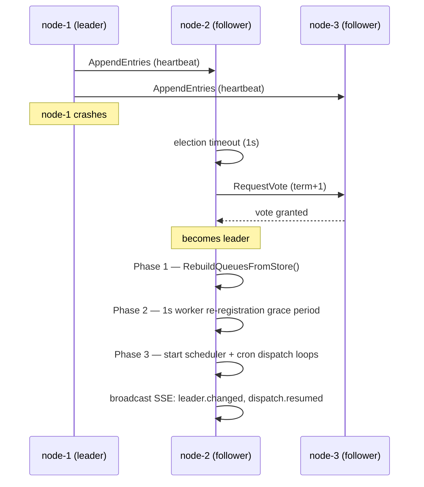
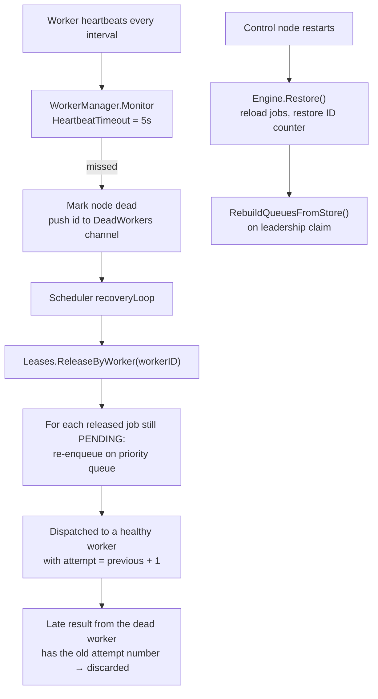

# Quorum

[](https://github.com/SrinivasVarma06/Job-Manager-Quorum/actions/workflows/ci.yml)

A distributed job orchestration platform written in Go — a from-scratch
Temporal/Airflow-lite. Quorum schedules, executes, retries and observes background
jobs across a fleet of worker processes, with Raft-backed leader election, a
write-ahead-logged control plane, lease-based failure detection, and a live
dashboard.

Built without a job framework: the priority scheduler, retry policy, token-bucket
rate limiter, circuit breaker, delay queue, dead-letter queue and lease manager are
all implemented in this repository.

```
POST /jobs → Raft log → BoltDB → priority queue → lease → gRPC → worker → result → retry/DLQ
```

---

## Table of Contents

- [Problem Statement](#problem-statement)
- [Architecture Overview](#architecture-overview)
- [Feature List](#feature-list)
- [Delivery Guarantees](#delivery-guarantees)
- [System Components](#system-components)
- [Scheduling Lifecycle](#scheduling-lifecycle)
- [Retry Lifecycle](#retry-lifecycle)
- [Leader Election Flow](#leader-election-flow)
- [Failure Recovery Flow](#failure-recovery-flow)
- [Observability](#observability)
- [Running Locally](#running-locally)
- [Docker Deployment](#docker-deployment)
- [Benchmarks](#benchmarks)
- [Tradeoffs](#tradeoffs)
- [Known Limitations](#known-limitations)
- [Future Roadmap](#future-roadmap)

---

## Problem Statement

Every backend eventually needs reliable async execution: send emails, resize images,
run ETL, retry payments. Cron plus "just use a queue" stops working at scale:

- **Workers crash mid-job.** Without leases and failure detection the job is silently
  lost, or worse, executed twice with no idempotency story.
- **Retries need policy.** Naive immediate retries turn one failing dependency into a
  retry storm; you need exponential backoff, a failure budget, and a circuit breaker.
- **The control plane is a single point of failure.** If the scheduler dies, nothing
  runs. Surviving that requires replicated state and leader election, not a cron box.
- **Operators need visibility.** Queue depth, worker health, p50/p95/p99 latency, and
  end-to-end traces from submit to execute.

Quorum implements all four, and documents explicitly what it guarantees
(at-least-once delivery) and what it does not (exactly-once).

---

## Architecture Overview

Three tiers: an API + control plane (Raft replicated), a scheduler owned by the
elected leader, and a fleet of stateless worker processes reached over gRPC.



**Data flow:** client submits a job → the API validates it → the engine proposes an
`AddJob` command through Raft → the FSM applies it to BoltDB → the leader's scheduler
pushes the job ID onto the priority heap → the dispatch loop pops it, acquires an
ephemeral lease and calls `SubmitJob` on a worker over gRPC → the worker executes
through the rate limiter and circuit breaker → the result comes back via
`ReportResult` → the scheduler releases the lease and marks the job completed,
schedules a retry, or writes it to the DLQ.

---

## Feature List

**Scheduling**
- Binary-heap priority queue (`internal/queue/heap.go`, `priority.go`)
- Delay queue for scheduled/future jobs (`internal/queue/delay.go`)
- Cron-style recurring jobs (`* * * * *` and `*/N * * * *`)
- Graceful shutdown via `context.Context` on every loop

**Reliability**
- Exponential backoff retries with a `MaxBackoff` ceiling (`internal/retry`)
- Dead-letter queue for jobs that exhaust retries
- Ephemeral execution leases with attempt counters; stale results from old attempts
  are discarded
- Heartbeat-based worker failure detection and automatic lease release + requeue
- Token-bucket rate limiter and circuit breaker wrapped around every executor
- Job status state machine with validated transitions (`job.IsValidTransition`)

**Distribution**
- Raft consensus for control-plane state (`hashicorp/raft`) with a custom FSM
- Leader-only scheduling: followers hold state but never dispatch
- gRPC worker protocol: `RegisterWorker`, `Heartbeat`, `SubmitJob`, `ReportResult`
- Topic/job-type routing so workers subscribe only to types they handle

**Durability**
- BoltDB-backed job store with status buckets, plus an in-memory store for tests
- Write-ahead log and snapshot/restore (`internal/storage`)
- Queue reconstruction from the store on leader election

**Observability**
- Structured `slog` logging with request IDs
- Prometheus metrics at `/metrics`
- OpenTelemetry tracing (OTLP/gRPC) spanning submit → schedule → execute
- Server-sent events at `/events` and an embedded dashboard at `/ui`

**Security & Authorization**
- HMAC-SHA256 (HS256) JWT authentication middleware (`Authorization: Bearer <token>`)
- Role-Based Access Control (RBAC) supporting `admin`, `submitter`, and `viewer` roles
- Configurable JWT secret via `QUORUM_JWT_SECRET` and optional enforcement via `QUORUM_AUTH_ENABLED`
- Contextual user claims propagation (`user_id`, `role`, `exp`, `iat`)

---

## Delivery Guarantees

Quorum provides **at-least-once execution** with **idempotent submission** via
idempotency keys.

### At-least-once execution

Quorum's scheduler uses retries and ephemeral leases. A worker may:

1. Acquire a lease and begin executing a job.
2. Crash (or lose connectivity) before reporting completion.
3. Cause the lease manager to detect the failure and re-enqueue the job.
4. Have the job executed again by a different (or the same) worker.

This means a job **may execute more than once**. Executors should be designed to
be idempotent — applying the same operation twice produces the same result.

### Idempotent submission via idempotency keys

Duplicate *submissions* (client-side retries or network hiccups that replay the
HTTP request) are deduplicated using an idempotency key. Pass
`"idempotency_key"` in the JSON body:

```bash
# First request — creates a new job
curl -X POST http://localhost:8080/jobs \
  -H "Content-Type: application/json" \
  -d '{"type":"email","priority":5,"idempotency_key":"order-123-email"}'
# → 201 Created
# {"id":1,"status":"submitted","idempotency_key":"order-123-email"}

# Second request with the same key — returns the original job, no duplicate
curl -X POST http://localhost:8080/jobs \
  -H "Content-Type: application/json" \
  -d '{"type":"email","priority":5,"idempotency_key":"order-123-email"}'
# → 200 OK
# {"id":1,"status":"submitted","idempotency_key":"order-123-email"}
```

**Behaviour contract:**

| Scenario | HTTP status | Result |
|---|---|---|
| First request with key | `201 Created` | New job created |
| Repeat request with same key | `200 OK` | Original job returned, no duplicate |
| Request without a key | `201 Created` | New job every time |

**Implementation details:**

- The idempotency key is stored on the `job.Job` struct (`idempotency_key`
  JSON field) and persisted through both the in-memory store and BoltDB.
- MemoryStore maintains an in-memory `map[string]int` index (O(1) lookup,
  protected by a read lock).
- BoltStore maintains a dedicated `idempotency_keys` bucket (O(1) BoltDB
  key lookup, no full-scan).
- The engine serialises the check-then-create step under `submitMu` to prevent
  a TOCTOU race between two concurrent requests with the same key.
- WAL replay and Raft FSM snapshots are unaffected: they serialize the full
  `job.Job` struct which already carries the key.
- Jobs submitted **without** a key bypass deduplication entirely — each call
  creates a new job as before (backward compatible).

---

## System Components

| Package | Responsibility |
|---|---|
| `cmd/server` | Control node: HTTP API, gRPC server, engine bootstrap, embedded UI |
| `cmd/worker` | Worker node: gRPC execution server, registration, heartbeats |
| `cmd/benchmark` | Throughput/latency harness |
| `internal/engine` | Wires everything together; owns leadership watch and lifecycle |
| `internal/handlers` | HTTP handlers for jobs, cron, cluster, metrics |
| `internal/middleware` | Request ID, tracing, logging middleware |
| `internal/scheduler` | Dispatch, result, delay and recovery loops; lease management |
| `internal/queue` | Priority heap, delay queue |
| `internal/retry` | `ShouldRetry`, exponential `Backoff`, `NextRetryTime` |
| `internal/executor` | Mock executor, token-bucket limiter, circuit breaker |
| `internal/runner` | Worker-side execution loop |
| `internal/workermanager` | Worker registry, heartbeats, dead-worker detection |
| `internal/broker` | Topic-aware worker selection |
| `internal/consensus` | Raft node + FSM (`AddJob`, `UpdateJob`, `DeleteJob`, `CancelJob`, `AddCronJob`, `DeleteCronJob`) |
| `internal/store` | BoltDB store, in-memory store, DLQ persistence |
| `internal/storage` | WAL append/replay, snapshot/restore |
| `internal/dlq` | In-memory dead-letter queue |
| `internal/cron` | Recurring job scheduler |
| `internal/rpc` | Protobuf definitions, gRPC client/server, worker proxy |
| `internal/metrics` | Prometheus collectors |
| `internal/tracing` | OpenTelemetry setup |
| `internal/events` | SSE broadcaster for the dashboard |
| `internal/oteltest` | In-memory span recorder used by the tracing tests |

---

## Scheduling Lifecycle



Job statuses are the *persistent desired state* only — `PENDING`, `SCHEDULED`,
`COMPLETED`, `FAILED`, `CANCELLED`. There is deliberately no `RUNNING` status on disk:
execution tracking lives in the leader's in-memory `LeaseManager`, so a leader crash
can never leave a stale `RUNNING` row behind (see `docs/adr/0001`).

---

## Retry Lifecycle

Backoff is `2^retry_count` seconds, capped at `MaxBackoff` (1 minute by default):
1s → 2s → 4s → … With the default `MaxRetries = 3`, a job gets 4 total attempts before
the DLQ.



Two additional guards sit in front of execution on the worker:

- **Token bucket** (`RateLimit` = 5/s, `RateBurst` = 10) throttles execution per worker.
- **Circuit breaker** opens after `BreakerFailureThreshold` (5) consecutive failures and
  half-opens after `BreakerResetTimeout` (30s), so a broken dependency fails fast
  instead of consuming the whole retry budget.

---

## Leader Election Flow

Only the Raft leader schedules. Followers apply the replicated log and serve reads,
but their dispatch loops are not running.



On losing leadership a node cancels the scheduler context and calls `Leases.Clear()`,
so it stops dispatching immediately and drops all ephemeral execution claims.
`GET /cluster/raft` reports `is_leader`, `term`, `leader_addr` and `node_id`.

---

## Failure Recovery Flow



Two independent recovery paths: **worker death** is handled by lease expiry and
requeue, **control-node restart** is handled by BoltDB persistence plus queue
reconstruction. The attempt counter carried on every lease and result is what makes
the requeue safe against double-acking — a stale result from a presumed-dead worker is
dropped rather than marking the job complete.

---

## Observability

**Metrics** — Prometheus text format at `GET /metrics`:

| Metric | Type | Meaning |
|---|---|---|
| `quorum_jobs_submitted_total` | counter | jobs accepted by the API |
| `quorum_jobs_completed_total` | counter | successful executions |
| `quorum_jobs_failed_total` | counter | failed executions |
| `quorum_jobs_cancelled_total` | counter | cancellations |
| `quorum_queue_depth` | gauge | jobs waiting in the queue |
| `quorum_active_workers` | gauge | healthy registered workers |
| `quorum_job_execution_duration_seconds` | histogram | execution latency (10 buckets, 10ms → 10s) |

**Tracing** — OpenTelemetry with an OTLP/gRPC exporter. Set
`OTEL_EXPORTER_OTLP_ENDPOINT` (default `localhost:4317`). Spans include
`engine.submit_job`, `raft.propose`, `raft.apply`, `scheduler.enqueue`,
`scheduler.dispatch`, `scheduler.promote_delayed_job`, `runner.execute`,
`worker.receive_job`, `worker.execute_job` and `worker.complete_job`, plus the HTTP
middleware span, propagated with W3C trace context. Every tracing-instrumented package has a
`tracing_test.go` asserting span names, attributes and error status using the
in-memory recorder in `internal/oteltest`.

**Logging** — structured `slog` text output; every HTTP request carries a request ID
injected by `middleware.RequestID`.

**Live dashboard** — `GET /ui` serves an embedded single-page dashboard fed by
server-sent events from `GET /events` (lease granted/released, leader changed,
worker registered/evicted, queue rebuilt, dispatch resumed).

---

## Running Locally

Requires **Go 1.26+** (see `go.mod`).

```bash
git clone https://github.com/SrinivasVarma06/Job-Manager-Quorum.git
cd Job-Manager-Quorum
go mod download
go test ./...
```

Start the control node (HTTP :8080, gRPC :50051, Raft :18088):

```bash
go run ./cmd/server
```

Start a worker in a second terminal:

```bash
QUORUM_WORKER_ID=1 QUORUM_WORKER_PORT=50052 QUORUM_WORKER_TOPICS=email,video_processing \
  go run ./cmd/worker
```

Submit a job and watch it run:

```bash
curl -X POST localhost:8080/jobs -H 'Content-Type: application/json' \
  -d '{"type":"email","priority":5}'
curl localhost:8080/jobs
curl localhost:8080/cluster/status
open http://localhost:8080/ui
```

Full walkthrough: [`docs/quickstart.md`](docs/quickstart.md).
API reference: [`docs/api.md`](docs/api.md).

---

## Docker Deployment

```bash
docker compose up --build
```

Brings up three control nodes (`:8080`, `:8081`, `:8082`) and two worker containers.
Chaos/failover script:

```bash
SERVER_URL=http://localhost:8080 ./scripts/chaos.sh
```

Details and the multi-node caveats: [`docs/deployment.md`](docs/deployment.md).

---

## Benchmarks

`cmd/benchmark` drives the engine directly and reports throughput and latency
percentiles. Raw data: [`benchmarks/results.md`](benchmarks/results.md),
`benchmarks/results.csv`, `benchmarks/scaling.csv`.

| Workers | Jobs | Throughput | p50 | p95 | p99 |
|---:|---:|---:|---:|---:|---:|
| 10 | 1000 | 4,959/s | 75.9 ms | 190.8 ms | 201.1 ms |
| 10 | 1000 | 6,494/s | 65.4 ms | 143.4 ms | 143.9 ms |
| 10 | 1000 | 6,879/s | 67.1 ms | 135.2 ms | 145.4 ms |

```bash
go run ./cmd/benchmark
```

Numbers are single-machine, in-process, with the mock executor — they measure
scheduler and queue overhead, not real job work.

---

## Tradeoffs

**At-least-once, not exactly-once.** A worker can execute a job and die before its
`ReportResult` lands; the lease expires and the job is retried. True exactly-once needs
either idempotent side effects or a distributed transaction between broker and worker
state. Quorum chooses at-least-once and says so. *Idempotency keys are not yet
implemented — see [Known Limitations](#known-limitations).*

**`hashicorp/raft` instead of a hand-rolled Raft.** The consensus algorithm is a solved
problem with subtle liveness bugs; the interesting work here is the FSM design and the
leader startup sequence. A from-scratch implementation is on the roadmap as a learning
exercise, not as a production replacement.

**No `RUNNING` status on disk.** Execution state is ephemeral leader memory. This keeps
the Raft log small and makes leader crashes recoverable without a reconciliation pass,
at the cost of losing execution progress visibility across a failover
(`docs/adr/0001`).

**Monolithic control plane.** The API, scheduler and consensus layer run in one
process. They are consistency-critical and chatty; splitting them into services would
add network hops and failure modes without buying isolation.

**BoltDB over an external database.** Single-file embedded storage means no external
dependency and a straightforward snapshot story, at the cost of single-writer
throughput and no cross-node reads — which is fine, since only the leader writes.

**Custom broker over Kafka.** The topic router in `internal/broker` exists to learn
partitioning and consumer semantics. Kafka would give durability, replay and consumer
groups for free; Quorum currently trades all of that away for a ~100-line component
you can read in one sitting.

---

## Known Limitations

Honest list of what the code does *not* do yet, so the docs don't overstate it:

- **Idempotency keys are not implemented.** There is no dedup key on `job.Job` and no
  dedup check before execution, so at-least-once delivery can produce duplicate side
  effects for non-idempotent job types.
- **The Raft log and stable store are in-memory** (`raft.NewInmemStore` in
  `internal/consensus/raft.go`). Job state survives restart through BoltDB, but the
  replicated log itself does not.
- **Nodes do not auto-join a cluster.** Each control node bootstraps itself as a
  single-node Raft cluster; `AddVoter`/`RemoveServer` exist but are not wired to a join
  endpoint, so `docker compose up` yields three independent single-node clusters rather
  than one three-node quorum.
- **Config is not read from the environment on the control node.** `config.Default()`
  returns hardcoded values; the `RAFT_NODE_ID`, `RAFT_ADDR`, `RAFT_DATA_DIR`,
  `CONTROLLER_GRPC_PORT` and `STORAGE_PATH` variables set in `docker-compose.yml` are
  currently ignored. Only `cmd/worker` reads `QUORUM_WORKER_ID`,
  `QUORUM_WORKER_PORT` and `QUORUM_WORKER_TOPICS`.
- **The worker containers in `docker-compose.yml` are passed CLI flags**
  (`-id`, `-controller`, `-topics`) that `cmd/worker` does not parse; it uses the
  environment variables above and dials `localhost`.
- **No authentication or authorization.** No JWT, no RBAC; gRPC uses
  `insecure.NewCredentials()`.
- **The executor is a mock.** `executor.MockExecutor` simulates work; there is no
  pluggable user-supplied job handler registry yet.
- **`POST /cluster/failover-simulate` is a UI demo** that broadcasts a scripted event
  sequence — it does not kill a real leader. Use `scripts/chaos.sh` for that.
- **`GET /jobs/leases` always returns `{}`.** The handler JSON-encodes
  `job.LeaseManager`, whose `leases` map is unexported, so nothing is marshalled. It
  needs a `List()` accessor or a `MarshalJSON` method.
- **Cron supports two schedule forms only**: `* * * * *` and `*/N * * * *`.

---

## Future Roadmap

Near term
- Idempotency keys with dedup on submit and before execution
- Persistent Raft log store (BoltDB-backed) and a `/cluster/join` endpoint
- Environment-driven configuration for the control node
- GitHub Actions CI: build, vet, test, race detector

Medium term
- A real broker: partitions, ack/requeue, consumer groups, consistent-hash assignment
- Security phase: JWT + RBAC on the API, mTLS between workers and the control plane
- Prometheus + Grafana + a trace collector in `docker-compose.yml`, with dashboards
- Kubernetes manifests, Helm chart, Terraform, HPA on queue depth

Longer term
- Multi-tenant quotas and per-tenant ingress rate limiting
- DLQ replay UI
- k6 load tests and toxiproxy partition chaos with invariant assertions
- TLA+ spec of the lease/leader-election protocol

Full phase-by-phase plan: [`docs/roadmap.md`](docs/roadmap.md).

---

## Documentation

| Document | Contents |
|---|---|
| [`docs/quickstart.md`](docs/quickstart.md) | Five-minute end-to-end walkthrough |
| [`docs/api.md`](docs/api.md) | HTTP API reference with examples |
| [`docs/deployment.md`](docs/deployment.md) | Single-node, Compose, cluster, recovery |
| [`docs/observability.md`](docs/observability.md) | Prometheus, Grafana, Jaeger deployment & dashboards |
| [`docs/architecture.md`](docs/architecture.md) | Deeper architecture notes |
| [`docs/adr/`](docs/adr/) | Architecture decision records |
| [`docs/handbook/`](docs/handbook/) | Go and distributed-systems study notes |
| [`docs/interview-notes.md`](docs/interview-notes.md) | Design Q&A |
| [`CONTRIBUTING.md`](CONTRIBUTING.md) | Development workflow |
