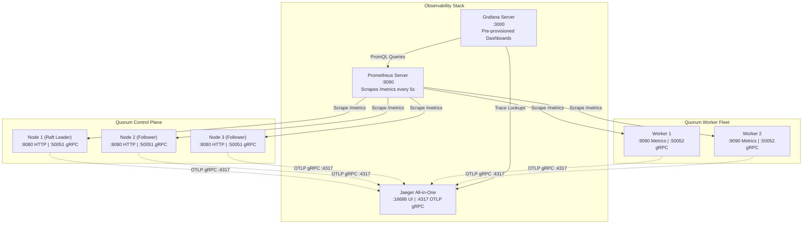

# Observability Architecture & Deployment Guide

Quorum includes a production-grade observability stack comprising **Prometheus** for timeseries metrics, **Grafana** for pre-provisioned visualization dashboards, and **Jaeger** for distributed end-to-end OpenTelemetry (OTLP) tracing across all control nodes and workers.

---

## 1. Observability Architecture



---

## 2. Quickstart & Service Endpoints

### Starting the Full Stack

Run the complete 3-node Raft cluster, 2 workers, and observability stack:

```bash
# Start all services in background
docker compose up -d

# Verify all containers are healthy
docker compose ps
```

### Access URLs & Default Credentials

| Service | Host Port | In-Cluster URL | Default Credentials | Description |
|---|---|---|---|---|
| **Grafana** | `http://localhost:3000` | `http://grafana:3000` | `admin` / `admin` | Auto-provisioned dashboards |
| **Prometheus** | `http://localhost:9090` | `http://prometheus:9090` | None | Raw PromQL query console & targets |
| **Jaeger UI** | `http://localhost:16686` | `http://jaeger:16686` | None | Distributed trace search and waterfalls |
| **Control Node 1** | `http://localhost:8080` | `http://node-1:8080` | None | Primary HTTP API & Web Dashboard |
| **Control Node 2** | `http://localhost:8081` | `http://node-2:8080` | None | Secondary HTTP API |
| **Control Node 3** | `http://localhost:8082` | `http://node-3:8080` | None | Tertiary HTTP API |
| **Worker 1 Metrics**| `http://localhost:9091` | `http://worker-1:9090` | None | Worker 1 Prometheus metrics |
| **Worker 2 Metrics**| `http://localhost:9092` | `http://worker-2:9090` | None | Worker 2 Prometheus metrics |

---

## 3. Provisioned Grafana Dashboards

Grafana is configured with automatic provisioning (`deploy/grafana/provisioning/`) to discover and load dashboards from `deploy/grafana/dashboards/` on container boot.

### A. Cluster Dashboard (`quorum-cluster-dashboard`)
Monitors high-level cluster topology, Raft node states, and cluster capacity.
- **Active Control Nodes**: Gauge counting online Raft nodes (`count(up{job="quorum-nodes"})`).
- **Healthy Active Workers**: Count of currently registered and heartbeating workers (`max(quorum_active_workers)`).
- **Total Submitted / Completed Jobs**: Aggregate counters for all processed units of work.
- **Cluster Node Health Timeseries**: Per-instance status tracking node availability.

### B. Scheduler Dashboard (`quorum-scheduler-dashboard`)
Provides deep insight into the leader node's priority queue, ingress rates, and dispatch dynamics.
- **Current Queue Depth**: Real-time gauge of jobs awaiting worker dispatch (`quorum_queue_depth`).
- **Job Ingress Rate**: Submitted jobs per second (`sum(rate(quorum_jobs_submitted_total[1m]))`).
- **Total Failed / Cancelled Jobs**: Cumulative failures and user cancellations.
- **Job Lifecycle Throughput Rates**: Multi-series timeseries showing submitted, completed, failed, and cancelled rates simultaneously.

### C. Worker Dashboard (`quorum-worker-dashboard`)
Tracks execution latency, worker efficiency, rate limiting, and failure rates.
- **Throughput (Jobs / Sec)**: `sum(rate(quorum_jobs_completed_total[1m]))`.
- **Job Success Rate (%)**: Calculated percentage of completed versus failed jobs.
- **p50, p90, p99 Latency**: Quantiles computed over execution duration histograms:
  `histogram_quantile(0.95, sum(rate(quorum_job_execution_duration_seconds_bucket[5m])) by (le))`
- **Per-Instance Worker Execution Rate**: Individual breakdown of worker throughput.

---

## 4. Distributed Tracing with OpenTelemetry & Jaeger

Quorum emits OpenTelemetry spans across the entire request and job execution lifecycle:

```
[HTTP POST /jobs] (handlers.submit_job)
  └── [Raft Propose] (raft.propose)
        └── [Raft Apply / FSM Store] (raft.apply)
              └── [Scheduler Dispatch] (scheduler.dispatch)
                    └── [Worker Receive] (worker.receive_job)
                          └── [Worker Execute] (worker.execute_job)
                                └── [Runner Pipeline] (runner.execute)
                                      └── [Worker Complete] (worker.complete_job)
```

### Inspecting Traces in Jaeger

1. Open `http://localhost:16686` in your browser.
2. Select **Service**: `quorum-server` or `quorum-worker-1` / `quorum-worker-2`.
3. Click **Find Traces** to view waterfall diagrams with span tags (`job.id`, `job.type`, `worker.id`, `execution.duration_ms`).

---

## 5. Verification & Testing

### Submitting Sample Workload

Generate telemetry data by submitting sample background jobs:

```bash
# Submit immediate job with idempotency key
curl -X POST http://localhost:8080/jobs \
  -H "Content-Type: application/json" \
  -d '{"type":"email","priority":10,"idempotency_key":"test-job-1"}'

# Submit batch of jobs
for i in {1..20}; do
  curl -s -X POST http://localhost:8080/jobs \
    -H "Content-Type: application/json" \
    -d "{\"type\":\"video_processing\",\"priority\":$((i % 5))}" > /dev/null
done
```

### Verifying Metrics & Traces

1. **Verify Prometheus Scrapes**: Open `http://localhost:9090/targets` and confirm all 5 endpoints (`quorum-nodes` and `quorum-workers`) are `UP`.
2. **Verify Grafana Dashboards**: Open `http://localhost:3000/dashboards` to view the three provisioned Quorum dashboards.
3. **Verify Jaeger Traces**: Open `http://localhost:16686` and verify `quorum-server` and `quorum-worker` traces are captured.
